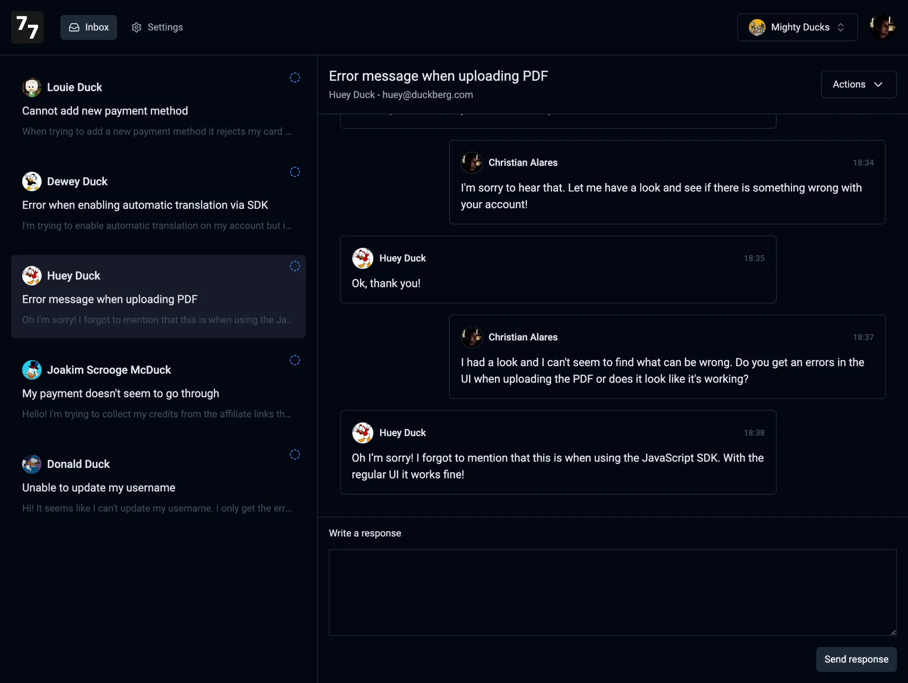

<p align="center">
  <a href="https://seventy-seven.dev">
    
  </a>
</p>

<h1 align="center">The open-source alternative to Zendesk</h1>
<p align="center">A modern and simple platform to make customer support extremely easy</p>

<p align="center">
  <a href="https://seventy-seven.dev">Website</a> · 
  <a href="https://app.seventy-seven.dev">Sign in</a> · 
  <a href="https://twitter.com/c_alares">𝕏 / Twitter</a>
<p>

<p align="center">
  <a href="https://seventy-seven.dev">
    
  </a>
</p>

---

Seventy Seven is an easy to use customer support service. Use the endpoint for your users to create a support ticket, and use our dashboard to conversate.

## Stack
- Next.js (14) - Framework
- Supabase - Database, authentication and storage
- Resend - Transactional emails
- Trigger.dev - Scheduled background jobs
- TailwindCSS - Styling
- Shadcn - UI
- OpenPanel - Analytics

## Disclaimer
The product is in beta which means that some of the functionality you want or need is either not yet implemented or could contain some bugs. Don't hesitate to hit me up on 𝕏 ([@c_alares](https://twitter.com/c_alares)) or create a github issue.

## Notes:
We will add this Biome rule when they're is ready for this rule to be formatted on auto-save.
```
"nursery": {
  "useSortedClasses": {
    "level": "warn",
    "options": {
      "attributes": ["className"],
      "functions": ["cn", "cva"]
    }
  }
}
```
Read more here: https://biomejs.dev/linter/rules/use-sorted-classes/